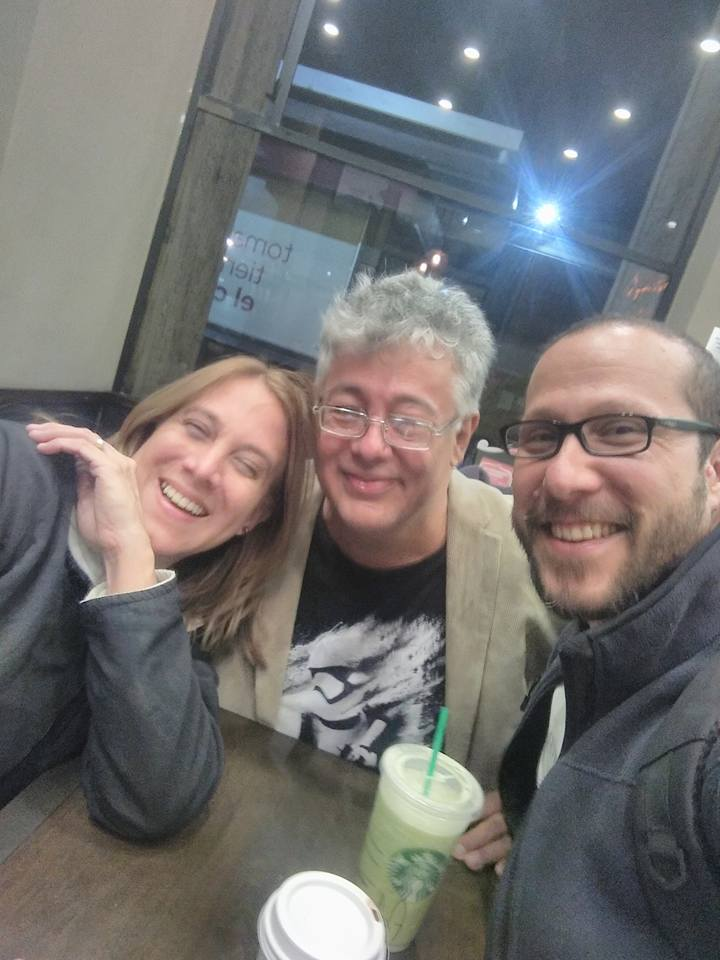

# *My experience working with Mario*

I met Mario in January 2011 just when I was beginning my doctoral studies at Universidad Simón Bolívar (USB) in Venezuela. I had the opportunity of attending several lectures where Mario illustrated his understanding of complex systems and why physics can benefit from it.

During my doctorate, Mario taught me how to think like a physicist when designing an agent-based experimental simulation of Venezuelan urban traffic. A preliminary study co-authored with Mario is available as a preprint here: .

Among many other things, Mario taught me how to write the introduction of any scientific paper following the standards of [Jon Claerbout](https://sepwww.stanford.edu/sep/prof/Intro.html) which I also teach to my students because I find them highly useful.

After my PhD graduation, Mario and I have collaborated with other colleagues in several research projects, including the following ones:

 

Mario is not only an outstanding professor but an excellent friend and colleague 
